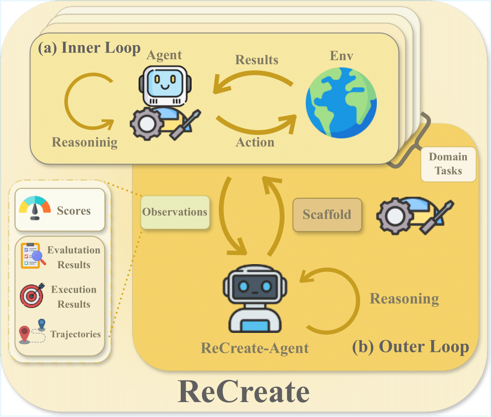
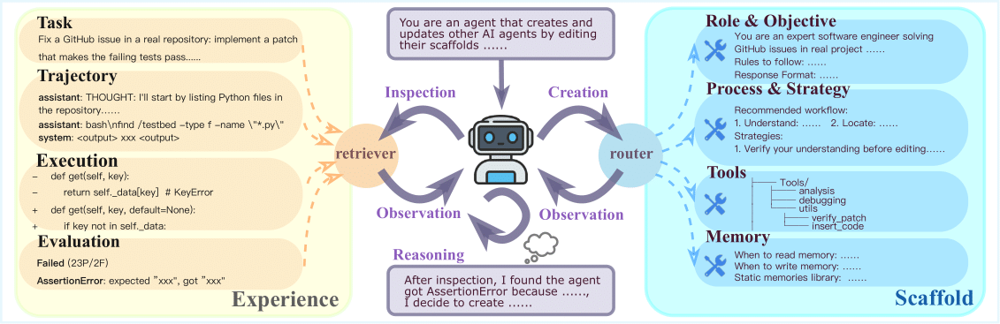

# ReCreate: Reasoning and Creating Domain Agents Driven by Experience

<p align="center">
  <a href="#abstract">Abstract</a> •
  <a href="#installation">Installation</a> •
  <a href="#usage">Usage</a> •
  <a href="#supported-domains">Domains</a> •
  <a href="#project-structure">Structure</a> •
  <a href="#citation">Citation</a>
</p>

## Abstract

Large Language Model (LLM) agents are reshaping the industrial landscape. However, most practical agents remain human-designed because tasks differ widely, making them labor-intensive to build. This situation poses a central question: *can we automatically create and adapt domain agents in the wild?* While several recent approaches have sought to automate agent creation, they typically treat agent generation as a black-box procedure and rely solely on final performance metrics to guide the process. Such strategies overlook critical evidence explaining why an agent succeeds or fails, and often require high computational costs.

To address these limitations, we propose **ReCreate**, an experience-driven framework for the automatic creation of domain agents.


<p align="center">
  
</p>

ReCreate systematically leverages agent interaction histories, which provide rich concrete signals on both the causes of success or failure and the avenues for improvement. Specifically, we introduce an *agent-as-optimizer* paradigm that effectively learns from experience via three key components:

1. **Experience Storage & Retrieval**: An on-demand inspection mechanism for agent trajectories
2. **Reasoning-Creating Synergy**: A pipeline that maps execution experience into scaffold edits
3. **Hierarchical Updates**: Abstraction of instance-level details into reusable domain patterns


<p align="center">
  
</p>

In experiments across diverse domains, ReCreate consistently outperforms human-designed agents and existing automated agent generation methods, even when starting from minimal seed scaffolds.

## Installation

### Quick Start

```bash

# Installation
cd ReCreate

conda create -n recreate python=3.10 -y
conda activate recreate
pip install -r requirements.txt
pip install -e .

# Set API keys (required)
export OPENAI_API_KEY="your-key"
export ANTHROPIC_API_KEY="your-key"

# Optional: GitHub token for enhanced search functionality
# export GITHUB_TOKEN="your-github-token"

# Optional: Custom API base URL (for proxy/internal APIs like Azure, Venus, etc.)
# If using a proxy that's compatible with OpenAI API format:
# export LLM_API_BASE="http://your-api-proxy.com/llmproxy"

# Optional: Set custom paths
# export RECREATE_OUTPUT_DIR="./output"  # or use OUTPUT_DIR
# export RECREATE_RUNS_DIR="./runs_recreate"
# export APPWORLD_ROOT="./datasets/appworld/data"

# Optional: Model configuration (or use --agent-model/--recreate-model in commands)
# export AGENT_MODEL="gpt-5-mini"
# export RECREATE_MODEL="claude-opus-4-5-20251101"
```

### Requirements

- Python 3.10+ (Python 3.11+ required for AppWorld domain)
- Docker (for sandboxed evaluation)
- API keys for LLM providers (OpenAI, Anthropic, etc.)
- GitHub token (optional, for enhanced GitHub search functionality)

### Domain-Specific Setup

<details>
<summary>SWE-bench</summary>

```bash
cd datasets/swebench && pip install -e .
# Docker images are automatically pulled from Docker Hub on first run
```
</details>


<details>
<summary>DA-Code</summary>

```bash
cd datasets/dacode && pip install -r requirements.txt
cd docker && docker build -t da_agent-image:latest .
```
</details>

<details>
<summary>DS-1000</summary>

```bash
pip install matplotlib scipy
cd datasets/ds1000/docker && docker build -t ds1000-image:latest .
```
</details>

<details>
<summary>Math</summary>

**Data:** MATH-500 is automatically downloaded from HuggingFace. AIME/AMC data is included in `datasets/math/data/`.

```bash
cd datasets/math/docker && docker build -t math-env:latest .
```
</details>

<details>
<summary>AppWorld</summary>

**Note:** AppWorld runs inside Docker (Python 3.11). The host environment does NOT need AppWorld SDK installed.

```bash
# Step 1: Extract AppWorld source code (required for Docker build)
# Create a temporary Python 3.11 environment to run appworld install
conda create -n appworld_setup python=3.11 -y
conda activate appworld_setup
cd datasets/appworld && pip install -e .
appworld install
conda deactivate
# After this, you can remove the temporary environment:
# conda remove -n appworld_setup --all -y

# Step 2: Download AppWorld data (~200MB)
# Option A: Use appworld CLI (if SDK is installed)
appworld download data
# Option B: Download manually from https://appworld.dev/

# Step 3: Build Docker image (from ReCreate root directory)
cd /path/to/ReCreate
docker build -t appworld-agent:latest -f datasets/appworld/docker/Dockerfile datasets/appworld

# Step 4: Set environment variable (add to ~/.bashrc for persistence)
export APPWORLD_ROOT="$(pwd)/datasets/appworld"
```

The task metadata is pre-cached in `datasets/appworld/config/task_cache.json`, so the host environment only needs to read task definitions without importing the AppWorld SDK at runtime.
</details>


## Usage

### Run All Domains

```bash
bash scripts/run_all_domains.sh
```

### Run Single Domain

```bash
# SWE-bench
DOMAIN=swe SWE_SUBSET=django bash scripts/run_evolve.sh

# DA-Code
DOMAIN=dacode DACODE_SUBSET=ml bash scripts/run_evolve.sh

# DS-1000
DOMAIN=ds1000 DS1000_SUBSET=Pandas bash scripts/run_evolve.sh

# Math
DOMAIN=math bash scripts/run_evolve.sh

# AppWorld
DOMAIN=appworld bash scripts/run_evolve.sh
```

### Customize Models

You can configure models via command-line arguments or environment variables:

```bash
# Using command-line arguments (recommended)
DOMAIN=swe bash scripts/run_evolve.sh --agent-model gpt-5-mini --recreate-model claude-opus-4-5-20251101
```

### Configuration

| Variable | Description | Default |
|----------|-------------|---------|
| `DOMAIN` | Target domain | `swe` |
| `BATCH_SIZE` | Evolution batch size | `4` |
| `WORKERS` | Test parallelism | `4` |
| `N_REPEAT` | Evolution rounds | `2` |
| `AGENT_MODEL` | Model for Agent | `gpt-5-mini` |
| `RECREATE_MODEL` | Model for ReCreate-Agent | `claude-opus-4-5-20251101` |
| `OUTPUT_DIR` | Output directory | `./output` |
| `RECREATE_RUNS_DIR` | Trajectory save directory | `./runs_recreate` |
| `LLM_API_BASE` | Custom LLM API base URL (optional) | - |
| `APPWORLD_ROOT` | AppWorld data directory | `./datasets/appworld/data` |
| `GITHUB_TOKEN` | GitHub token for enhanced search (optional) | - |

## Supported Domains

| Domain | Description | Subsets |
|--------|-------------|---------|
| **SWE-bench** | GitHub issue resolution | django, sympy |
| **DA-Code** | Data analysis tasks | ml, sa, dm, visual, di |
| **DS-1000** | Data science code completion | Numpy, Pandas, Matplotlib, Sklearn, Scipy, Pytorch, Tensorflow |
| **Math** | Mathematical reasoning | math500, aime24, aime25, amc23 |
| **AppWorld** | Interactive API tasks | dev, test_normal, test_challenge |

## Project Structure

```
ReCreate/
├── scripts/
│   ├── run_all_domains.sh      # Run all domains
│   ├── run_evolve.sh           # Single domain evolution
│   ├── parallel_evolve.py      # Core evolution logic
│   └── evolve_utils/           # Evolution utilities
│       ├── evolution.py        # Core evolution functions
│       ├── scaffold_ops.py     # Scaffold operations
│       ├── stats.py            # Statistics collection
│       └── trajectory.py       # Trajectory analysis
├── src/
│   ├── recreate_agent/
│   │   ├── adapters/           # Domain adapters
│   │   ├── evaluators/         # Domain evaluators
│   │   ├── prompts/            # Prompt templates
│   │   ├── tools/              # ReCreate-Agent tools
│   │   ├── recreate_agent.py   # ReCreate-Agent core
│   │   └── scaffold.py         # Scaffold management
│   └── minisweagent/           # Base agent implementation
├── datasets/                   # Domain datasets
└── figs/                       # Paper figures
```

## Citation

```bibtex
@article{hao2026recreate,
  title={ReCreate: Reasoning and Creating Domain Agents Driven by Experience},
  author={Hao, Zhezheng and Wang, Hong and Luo, Jian and Zhang, Jianqing and Zhou, Yuyan and Lin, Qiang and Wang, Can and Dong, Hande and Chen, Jiawei},
  journal={arXiv preprint arXiv:2601.11100},
  year={2026}
}

```


## Contact

* Zhezheng Hao — [haozhezheng@outlook.com](mailto:haozhezheng@outlook.com)

